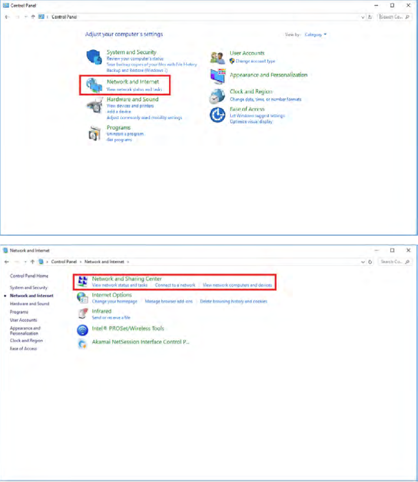
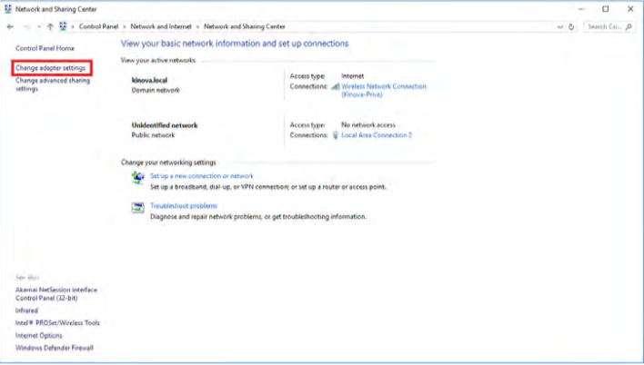
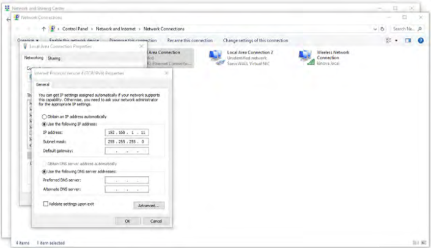
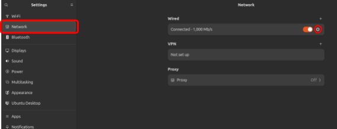
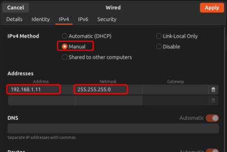

@import url(https://themes.googleusercontent.com/fonts/css?kit=po9qD2fJnsCVuKbNxdSTmRAddVmaxKjeGyrsf6WgWEE);.lst-kix\_i8ok9ofadkqz-8>li:before{content:"- "}.lst-kix\_i8ok9ofadkqz-7>li:before{content:"- "}.lst-kix\_ntqz4crqvkyw-2>li:before{content:"" counter(lst-ctn-kix\_ntqz4crqvkyw-2,lower-roman) ". "}.lst-kix\_ntqz4crqvkyw-4>li:before{content:"" counter(lst-ctn-kix\_ntqz4crqvkyw-4,lower-latin) ". "}.lst-kix\_ntqz4crqvkyw-3>li:before{content:"" counter(lst-ctn-kix\_ntqz4crqvkyw-3,decimal) ". "}.lst-kix\_i8ok9ofadkqz-3>li:before{content:"- "}.lst-kix\_ntqz4crqvkyw-6>li:before{content:"" counter(lst-ctn-kix\_ntqz4crqvkyw-6,decimal) ". "}.lst-kix\_i8ok9ofadkqz-2>li:before{content:"- "}.lst-kix\_ntqz4crqvkyw-5>li:before{content:"" counter(lst-ctn-kix\_ntqz4crqvkyw-5,lower-roman) ". "}ol.lst-kix\_ntqz4crqvkyw-8.start{counter-reset:lst-ctn-kix\_ntqz4crqvkyw-8 0}.lst-kix\_i8ok9ofadkqz-0>li:before{content:"- "}.lst-kix\_i8ok9ofadkqz-1>li:before{content:"- "}ol.lst-kix\_ntqz4crqvkyw-5.start{counter-reset:lst-ctn-kix\_ntqz4crqvkyw-5 0}.lst-kix\_ntqz4crqvkyw-7>li:before{content:"" counter(lst-ctn-kix\_ntqz4crqvkyw-7,lower-latin) ". "}.lst-kix\_ntqz4crqvkyw-8>li:before{content:"" counter(lst-ctn-kix\_ntqz4crqvkyw-8,lower-roman) ". "}ol.lst-kix\_ntqz4crqvkyw-8{list-style-type:none}ol.lst-kix\_q0hojh417q54-7{list-style-type:none}ol.lst-kix\_ntqz4crqvkyw-7{list-style-type:none}ol.lst-kix\_q0hojh417q54-8{list-style-type:none}.lst-kix\_ntqz4crqvkyw-8>li{counter-increment:lst-ctn-kix\_ntqz4crqvkyw-8}ol.lst-kix\_q0hojh417q54-5{list-style-type:none}ol.lst-kix\_q0hojh417q54-6{list-style-type:none}ol.lst-kix\_ntqz4crqvkyw-0.start{counter-reset:lst-ctn-kix\_ntqz4crqvkyw-0 0}ol.lst-kix\_q0hojh417q54-0{list-style-type:none}ol.lst-kix\_q0hojh417q54-3{list-style-type:none}ol.lst-kix\_q0hojh417q54-4{list-style-type:none}ol.lst-kix\_q0hojh417q54-1{list-style-type:none}ol.lst-kix\_q0hojh417q54-6.start{counter-reset:lst-ctn-kix\_q0hojh417q54-6 0}ol.lst-kix\_q0hojh417q54-2{list-style-type:none}.lst-kix\_1946cjf8w0oo-2>li:before{content:"- "}.lst-kix\_1946cjf8w0oo-0>li:before{content:"- "}.lst-kix\_q0hojh417q54-0>li{counter-increment:lst-ctn-kix\_q0hojh417q54-0}.lst-kix\_1946cjf8w0oo-1>li:before{content:"- "}ol.lst-kix\_ntqz4crqvkyw-0{list-style-type:none}ol.lst-kix\_ntqz4crqvkyw-2{list-style-type:none}ol.lst-kix\_q0hojh417q54-0.start{counter-reset:lst-ctn-kix\_q0hojh417q54-0 0}ol.lst-kix\_q0hojh417q54-3.start{counter-reset:lst-ctn-kix\_q0hojh417q54-3 0}.lst-kix\_ntqz4crqvkyw-0>li:before{content:"" counter(lst-ctn-kix\_ntqz4crqvkyw-0,decimal) ". "}ol.lst-kix\_ntqz4crqvkyw-1{list-style-type:none}ol.lst-kix\_ntqz4crqvkyw-4{list-style-type:none}ol.lst-kix\_ntqz4crqvkyw-3{list-style-type:none}ol.lst-kix\_ntqz4crqvkyw-6{list-style-type:none}.lst-kix\_ntqz4crqvkyw-1>li:before{content:"" counter(lst-ctn-kix\_ntqz4crqvkyw-1,lower-latin) ". "}ol.lst-kix\_ntqz4crqvkyw-5{list-style-type:none}ol.lst-kix\_q0hojh417q54-2.start{counter-reset:lst-ctn-kix\_q0hojh417q54-2 0}.lst-kix\_1946cjf8w0oo-8>li:before{content:"- "}.lst-kix\_ntqz4crqvkyw-7>li{counter-increment:lst-ctn-kix\_ntqz4crqvkyw-7}.lst-kix\_g2a1u5l9zxnr-6>li:before{content:"- "}.lst-kix\_1946cjf8w0oo-3>li:before{content:"- "}.lst-kix\_g2a1u5l9zxnr-7>li:before{content:"- "}ul.lst-kix\_1946cjf8w0oo-3{list-style-type:none}.lst-kix\_g2a1u5l9zxnr-8>li:before{content:"- "}ul.lst-kix\_1dioco4j0ecy-0{list-style-type:none}ul.lst-kix\_1946cjf8w0oo-4{list-style-type:none}ul.lst-kix\_1dioco4j0ecy-1{list-style-type:none}ul.lst-kix\_1946cjf8w0oo-1{list-style-type:none}ul.lst-kix\_1dioco4j0ecy-2{list-style-type:none}ul.lst-kix\_1946cjf8w0oo-2{list-style-type:none}.lst-kix\_1946cjf8w0oo-4>li:before{content:"- "}ul.lst-kix\_1946cjf8w0oo-0{list-style-type:none}.lst-kix\_1946cjf8w0oo-5>li:before{content:"- "}ul.lst-kix\_1dioco4j0ecy-7{list-style-type:none}.lst-kix\_1946cjf8w0oo-6>li:before{content:"- "}ul.lst-kix\_1dioco4j0ecy-8{list-style-type:none}ol.lst-kix\_ntqz4crqvkyw-2.start{counter-reset:lst-ctn-kix\_ntqz4crqvkyw-2 0}ul.lst-kix\_1dioco4j0ecy-3{list-style-type:none}ul.lst-kix\_1dioco4j0ecy-4{list-style-type:none}ul.lst-kix\_1dioco4j0ecy-5{list-style-type:none}.lst-kix\_1946cjf8w0oo-7>li:before{content:"- "}ul.lst-kix\_1dioco4j0ecy-6{list-style-type:none}ol.lst-kix\_ntqz4crqvkyw-7.start{counter-reset:lst-ctn-kix\_ntqz4crqvkyw-7 0}ol.lst-kix\_q0hojh417q54-8.start{counter-reset:lst-ctn-kix\_q0hojh417q54-8 0}.lst-kix\_q0hojh417q54-8>li{counter-increment:lst-ctn-kix\_q0hojh417q54-8}.lst-kix\_q0hojh417q54-2>li{counter-increment:lst-ctn-kix\_q0hojh417q54-2}.lst-kix\_q0hojh417q54-5>li{counter-increment:lst-ctn-kix\_q0hojh417q54-5}ol.lst-kix\_q0hojh417q54-1.start{counter-reset:lst-ctn-kix\_q0hojh417q54-1 0}.lst-kix\_q0hojh417q54-3>li:before{content:"" counter(lst-ctn-kix\_q0hojh417q54-3,decimal) ". "}.lst-kix\_q0hojh417q54-4>li:before{content:"" counter(lst-ctn-kix\_q0hojh417q54-4,lower-latin) ". "}.lst-kix\_q0hojh417q54-2>li:before{content:"" counter(lst-ctn-kix\_q0hojh417q54-2,lower-roman) ". "}.lst-kix\_ntqz4crqvkyw-1>li{counter-increment:lst-ctn-kix\_ntqz4crqvkyw-1}.lst-kix\_q0hojh417q54-0>li:before{content:"" counter(lst-ctn-kix\_q0hojh417q54-0,decimal) ". "}.lst-kix\_q0hojh417q54-1>li:before{content:"" counter(lst-ctn-kix\_q0hojh417q54-1,lower-latin) ". "}.lst-kix\_gpo1jyedob7-0>li:before{content:"- "}.lst-kix\_gpo1jyedob7-1>li:before{content:"- "}ol.lst-kix\_ntqz4crqvkyw-1.start{counter-reset:lst-ctn-kix\_ntqz4crqvkyw-1 0}ul.lst-kix\_i8ok9ofadkqz-8{list-style-type:none}.lst-kix\_gpo1jyedob7-3>li:before{content:"- "}ul.lst-kix\_i8ok9ofadkqz-7{list-style-type:none}.lst-kix\_q0hojh417q54-4>li{counter-increment:lst-ctn-kix\_q0hojh417q54-4}ul.lst-kix\_i8ok9ofadkqz-6{list-style-type:none}ul.lst-kix\_i8ok9ofadkqz-5{list-style-type:none}ol.lst-kix\_q0hojh417q54-7.start{counter-reset:lst-ctn-kix\_q0hojh417q54-7 0}ul.lst-kix\_g2a1u5l9zxnr-4{list-style-type:none}ul.lst-kix\_g2a1u5l9zxnr-3{list-style-type:none}.lst-kix\_ntqz4crqvkyw-4>li{counter-increment:lst-ctn-kix\_ntqz4crqvkyw-4}ul.lst-kix\_g2a1u5l9zxnr-6{list-style-type:none}ul.lst-kix\_g2a1u5l9zxnr-5{list-style-type:none}ul.lst-kix\_g2a1u5l9zxnr-0{list-style-type:none}.lst-kix\_gpo1jyedob7-2>li:before{content:"- "}.lst-kix\_q0hojh417q54-5>li:before{content:"" counter(lst-ctn-kix\_q0hojh417q54-5,lower-roman) ". "}ul.lst-kix\_g2a1u5l9zxnr-2{list-style-type:none}ul.lst-kix\_g2a1u5l9zxnr-1{list-style-type:none}ul.lst-kix\_g2a1u5l9zxnr-8{list-style-type:none}ul.lst-kix\_g2a1u5l9zxnr-7{list-style-type:none}.lst-kix\_q0hojh417q54-6>li:before{content:"" counter(lst-ctn-kix\_q0hojh417q54-6,decimal) ". "}ul.lst-kix\_i8ok9ofadkqz-4{list-style-type:none}ul.lst-kix\_i8ok9ofadkqz-3{list-style-type:none}.lst-kix\_q0hojh417q54-7>li:before{content:"" counter(lst-ctn-kix\_q0hojh417q54-7,lower-latin) ". "}.lst-kix\_q0hojh417q54-8>li:before{content:"" counter(lst-ctn-kix\_q0hojh417q54-8,lower-roman) ". "}ul.lst-kix\_i8ok9ofadkqz-2{list-style-type:none}.lst-kix\_w8arjfo25naz-7>li:before{content:"- "}ul.lst-kix\_i8ok9ofadkqz-1{list-style-type:none}.lst-kix\_ntqz4crqvkyw-3>li{counter-increment:lst-ctn-kix\_ntqz4crqvkyw-3}ul.lst-kix\_i8ok9ofadkqz-0{list-style-type:none}ol.lst-kix\_q0hojh417q54-4.start{counter-reset:lst-ctn-kix\_q0hojh417q54-4 0}.lst-kix\_w8arjfo25naz-8>li:before{content:"- "}.lst-kix\_ntqz4crqvkyw-5>li{counter-increment:lst-ctn-kix\_ntqz4crqvkyw-5}.lst-kix\_ntqz4crqvkyw-2>li{counter-increment:lst-ctn-kix\_ntqz4crqvkyw-2}.lst-kix\_w8arjfo25naz-3>li:before{content:"- "}.lst-kix\_w8arjfo25naz-5>li:before{content:"- "}.lst-kix\_w8arjfo25naz-2>li:before{content:"- "}.lst-kix\_w8arjfo25naz-6>li:before{content:"- "}ul.lst-kix\_1946cjf8w0oo-7{list-style-type:none}ul.lst-kix\_1946cjf8w0oo-8{list-style-type:none}ul.lst-kix\_1946cjf8w0oo-5{list-style-type:none}.lst-kix\_w8arjfo25naz-4>li:before{content:"- "}ul.lst-kix\_1946cjf8w0oo-6{list-style-type:none}ul.lst-kix\_gpo1jyedob7-7{list-style-type:none}ul.lst-kix\_gpo1jyedob7-6{list-style-type:none}.lst-kix\_gpo1jyedob7-8>li:before{content:"- "}ul.lst-kix\_gpo1jyedob7-8{list-style-type:none}ul.lst-kix\_w8arjfo25naz-7{list-style-type:none}.lst-kix\_gpo1jyedob7-7>li:before{content:"- "}ul.lst-kix\_w8arjfo25naz-6{list-style-type:none}.lst-kix\_q0hojh417q54-3>li{counter-increment:lst-ctn-kix\_q0hojh417q54-3}.lst-kix\_g2a1u5l9zxnr-5>li:before{content:"- "}ul.lst-kix\_w8arjfo25naz-8{list-style-type:none}ul.lst-kix\_w8arjfo25naz-3{list-style-type:none}.lst-kix\_g2a1u5l9zxnr-4>li:before{content:"- "}.lst-kix\_gpo1jyedob7-4>li:before{content:"- "}.lst-kix\_gpo1jyedob7-5>li:before{content:"- "}ul.lst-kix\_w8arjfo25naz-2{list-style-type:none}ul.lst-kix\_gpo1jyedob7-1{list-style-type:none}ul.lst-kix\_w8arjfo25naz-5{list-style-type:none}ul.lst-kix\_gpo1jyedob7-0{list-style-type:none}.lst-kix\_w8arjfo25naz-1>li:before{content:"- "}ul.lst-kix\_w8arjfo25naz-4{list-style-type:none}ul.lst-kix\_gpo1jyedob7-3{list-style-type:none}.lst-kix\_g2a1u5l9zxnr-2>li:before{content:"- "}ul.lst-kix\_gpo1jyedob7-2{list-style-type:none}.lst-kix\_gpo1jyedob7-6>li:before{content:"- "}ol.lst-kix\_ntqz4crqvkyw-6.start{counter-reset:lst-ctn-kix\_ntqz4crqvkyw-6 0}ul.lst-kix\_gpo1jyedob7-5{list-style-type:none}ul.lst-kix\_w8arjfo25naz-1{list-style-type:none}.lst-kix\_g2a1u5l9zxnr-3>li:before{content:"- "}.lst-kix\_q0hojh417q54-6>li{counter-increment:lst-ctn-kix\_q0hojh417q54-6}ul.lst-kix\_gpo1jyedob7-4{list-style-type:none}.lst-kix\_w8arjfo25naz-0>li:before{content:"- "}ul.lst-kix\_w8arjfo25naz-0{list-style-type:none}.lst-kix\_g2a1u5l9zxnr-0>li:before{content:"- "}.lst-kix\_q0hojh417q54-1>li{counter-increment:lst-ctn-kix\_q0hojh417q54-1}.lst-kix\_q0hojh417q54-7>li{counter-increment:lst-ctn-kix\_q0hojh417q54-7}.lst-kix\_g2a1u5l9zxnr-1>li:before{content:"- "}ol.lst-kix\_ntqz4crqvkyw-3.start{counter-reset:lst-ctn-kix\_ntqz4crqvkyw-3 0}.lst-kix\_ntqz4crqvkyw-0>li{counter-increment:lst-ctn-kix\_ntqz4crqvkyw-0}.lst-kix\_ntqz4crqvkyw-6>li{counter-increment:lst-ctn-kix\_ntqz4crqvkyw-6}.lst-kix\_1dioco4j0ecy-8>li:before{content:"- "}.lst-kix\_1dioco4j0ecy-7>li:before{content:"- "}.lst-kix\_1dioco4j0ecy-5>li:before{content:"- "}.lst-kix\_1dioco4j0ecy-4>li:before{content:"- "}.lst-kix\_1dioco4j0ecy-6>li:before{content:"- "}.lst-kix\_1dioco4j0ecy-2>li:before{content:"- "}.lst-kix\_1dioco4j0ecy-3>li:before{content:"- "}li.li-bullet-0:before{margin-left:-18pt;white-space:nowrap;display:inline-block;min-width:18pt}ol.lst-kix\_ntqz4crqvkyw-4.start{counter-reset:lst-ctn-kix\_ntqz4crqvkyw-4 0}ol.lst-kix\_q0hojh417q54-5.start{counter-reset:lst-ctn-kix\_q0hojh417q54-5 0}.lst-kix\_1dioco4j0ecy-1>li:before{content:"- "}.lst-kix\_i8ok9ofadkqz-4>li:before{content:"- "}.lst-kix\_1dioco4j0ecy-0>li:before{content:"- "}.lst-kix\_i8ok9ofadkqz-5>li:before{content:"- "}.lst-kix\_i8ok9ofadkqz-6>li:before{content:"- "}ol{margin:0;padding:0}table td,table th{padding:0}.c3{padding-top:18pt;padding-bottom:6pt;line-height:1.15;page-break-after:avoid;orphans:2;widows:2;text-align:left}.c13{padding-top:0pt;padding-bottom:3pt;line-height:1.15;page-break-after:avoid;orphans:2;widows:2;text-align:left}.c8{color:#000000;font-weight:400;text-decoration:none;vertical-align:baseline;font-size:20pt;font-family:"Cabin";font-style:normal}.c4{color:#000000;font-weight:400;text-decoration:none;vertical-align:baseline;font-size:12pt;font-family:"Cabin";font-style:normal}.c16{color:#000000;font-weight:400;text-decoration:none;vertical-align:baseline;font-size:26pt;font-family:"Cabin";font-style:normal}.c14{padding-top:20pt;padding-bottom:6pt;line-height:1.15;page-break-after:avoid;orphans:2;widows:2;text-align:left}.c12{color:#000000;font-weight:400;text-decoration:none;vertical-align:baseline;font-size:16pt;font-family:"Cabin";font-style:normal}.c5{color:#434343;font-weight:400;text-decoration:none;vertical-align:baseline;font-size:15pt;font-family:"Cabin";font-style:normal}.c15{padding-top:16pt;padding-bottom:4pt;line-height:1.15;page-break-after:avoid;orphans:2;widows:2;text-align:left}.c1{padding-top:0pt;padding-bottom:0pt;line-height:1.15;orphans:2;widows:2;text-align:left}.c7{color:#000000;text-decoration:none;vertical-align:baseline;font-size:12pt;font-style:normal}.c10{text-decoration-skip-ink:none;-webkit-text-decoration-skip:none;color:#1155cc;text-decoration:underline}.c17{background-color:#ffffff;max-width:468pt;padding:72pt 72pt 72pt 72pt}.c9{color:inherit;text-decoration:inherit}.c11{padding:0;margin:0}.c2{margin-left:36pt;padding-left:0pt}.c0{font-weight:400;font-family:"Source Code Pro"}.c6{height:12pt}.title{padding-top:0pt;color:#000000;font-size:26pt;padding-bottom:3pt;font-family:"Cabin";line-height:1.15;page-break-after:avoid;orphans:2;widows:2;text-align:left}.subtitle{padding-top:0pt;color:#666666;font-size:15pt;padding-bottom:16pt;font-family:"Arial";line-height:1.15;page-break-after:avoid;orphans:2;widows:2;text-align:left}li{color:#000000;font-size:12pt;font-family:"Cabin"}p{margin:0;color:#000000;font-size:12pt;font-family:"Cabin"}h1{padding-top:20pt;color:#000000;font-size:20pt;padding-bottom:6pt;font-family:"Cabin";line-height:1.15;page-break-after:avoid;orphans:2;widows:2;text-align:left}h2{padding-top:18pt;color:#000000;font-size:16pt;padding-bottom:6pt;font-family:"Cabin";line-height:1.15;page-break-after:avoid;orphans:2;widows:2;text-align:left}h3{padding-top:16pt;color:#434343;font-size:14pt;padding-bottom:4pt;font-family:"Cabin";line-height:1.15;page-break-after:avoid;orphans:2;widows:2;text-align:left}h4{padding-top:14pt;color:#666666;font-size:12pt;padding-bottom:4pt;font-family:"Cabin";line-height:1.15;page-break-after:avoid;orphans:2;widows:2;text-align:left}h5{padding-top:12pt;color:#666666;font-size:11pt;padding-bottom:4pt;font-family:"Cabin";line-height:1.15;page-break-after:avoid;orphans:2;widows:2;text-align:left}h6{padding-top:12pt;color:#666666;font-size:11pt;padding-bottom:4pt;font-family:"Cabin";line-height:1.15;page-break-after:avoid;font-style:italic;orphans:2;widows:2;text-align:left}

KINOVA Arm Documentation

This is the documentation guide for the KINOVA Gen3 Ultra Lightweight robot arm. This arm is very expensive, so please read this documentation carefully and completely. If there are any questions ask the Funrobo teaching team or consult the offical KINOVA documentation.

Physical Setup
==============

The KINOVA arm should be installed on a table for you already in the back of the classroom. As a general overview, the physical setup includes screwing the base onto the robot, and clamping the robot arm to the table.

For physical setup, you do need to:

*   Ensure that the blue ethernet cable is plugged into the back of the robot arm and into your computer

*   Ensure that the power supply brick is plugged into the ESTOP
*   Ensure that the ESTOP is depressed (twist it in the directions of the arrows to depress it)
*   The arm is clear of any obstacles that might damage it

After you have checked all of the above, you can turn on the robot arm by holding the silver power button on the top left of the arm control panel for 3 seconds

Communication Setup
===================

The first step of setting up your computer will be making sure you can talk to the KINOVA arm. Verify that the ethernet cable is plugged into the arm and your computer, and that the robot is on.

Windows Instructions
--------------------

1.  On your computer, open Control Panel > Network and Internet > Network and Sharing Center
2.  Select Change adapter settings
3.  Select wired Ethernet adapter (i.e. Local Area Connection) and choose Properties.  
    
4.  Select Internet Protocol Version 4 (TCP/IPv4) and choose Properties.  
    
5.  Select Use the following IP address and enter IPv4 address and the Subnet mask. IPv4 address is 192.168.1.11. Subnet mask is 255.255.255.0
6.  Press OK

Linux Instructions
------------------

1.  Go to “Network” Settings & Press the “Settings Icon”

2.  Go to IPv4 Settings. Set the Method to “Manual”, Address to 192.168.1.11, and Netmask to 255.255.255.0

3.  Press Apply

Mac Instructions
----------------

TODO, I dont have a Mac :(

Computational Setup
===================

Install UV
----------

This codebase uses UV as its python environment manager. UV is similar to conda, but way faster and a lot easier to use. You should probably look into UV to manage all of your python projects since its quickly becoming the standard.

### Windows Instructions

Run the following command to install UV:  

powershell -ExecutionPolicy ByPass -c "irm https://astral.sh/uv/install.ps1 | iex"

### Linux Instructions

Run the following command to install UV:

curl -LsSf https://astral.sh/uv/install.sh | sh

Codebase
--------

First fork the kinova-control-system repo from github (link). Then clone it onto your local filesystem:

git clone [https://github.com/](https://www.google.com/url?q=https://github.com/&sa=D&source=editors&ust=1775837108154458&usg=AOvVaw2JCby1-6AkyDpJLjoLfDWv)<username>/kinova-control-system

Now you have to get the python environment setup. Since we are using UV, it is as simple as running:

uv sync

This will take a second, but once it is done, everything is all setup for you. You can enter the virtual environment normally by running:

source .venv/bin/activate

To verify that everything worked correctly, run:

python [test.py](https://www.google.com/url?q=http://test.py&sa=D&source=editors&ust=1775837108155805&usg=AOvVaw2rDpW06vjhn5lVHA5zHs__)

NOTE: This will ONLY work if you are in the UV virtual environment, if you are not in the virtual environment (it does not say (kinova-control-system) in your terminal) either activate it by following the above instructions or run uv run python [test.py](https://www.google.com/url?q=http://test.py&sa=D&source=editors&ust=1775837108156409&usg=AOvVaw033zPMlPCjou_a_zT2727Y))

The expected output should be:

Testing Environment...

Environment is ready to go

Have fun using the Kinova Robot Arm!

NOTE: This will ONLY work if you are actually connected to the KINOVA robot. Follow the Physical and Communication Setup instructions to connect to the robot.

Codebase Documentation
======================

Overview
--------

This codebase is set up to be similar to how ARDUINO CODE is written. There is an abstraction layer made for you that handles all of the robot connection code.

The backend code is stored in the backend/ folder. I recommend that you DO NOT TOUCH ANY CODE IN THIS FOLDER. The Kinova library is pretty intuitive, but if you don’t know what you are doing you could seriously damage the very expensive robot. There are failsafes and safety checks in the abstraction layer that hopefully stop you from doing any irreparable damage.

There is an [example.py](https://www.google.com/url?q=http://example.py&sa=D&source=editors&ust=1775837108158859&usg=AOvVaw2zeiwRFWNvwONfzVGi9uP6) file that shows how to get the arm to move. You should look at this file, but make any new code in the [main.py](https://www.google.com/url?q=http://main.py&sa=D&source=editors&ust=1775837108159041&usg=AOvVaw0k7kZG4sL5XsqwaR0F--YX) file to be consistent with Python standards. The only 2 functions you should have to change in the [main.py](https://www.google.com/url?q=http://main.py&sa=D&source=editors&ust=1775837108159211&usg=AOvVaw0CujmWJOc-pQ1pst9YDEX4) file are:

*   start()
*   loop()

These behave exactly like the Arduino start and loop functions:

*   The start() function will run exactly once, right after the Kinova arm is initialized.
*   The loop() function will run periodically, at a specific loop\_rate.
*   By default the loop\_rate is set to be 20Hz, which you can change in the Main() class definition.

You can use the Kinova arm with these public methods:

*   set\_joint\_angles()
*   get\_joints\_angles()
*   stop()

NOTE: Angles in the abstraction layer all work in radians, but the actual arm operates in degrees. This means if you mess around with the backend, be very careful since you can very easily forget that the actual Kinova library works in degrees and break it.

Usage
-----

To actually use this code, you will have to make an instance of the Main class:

<var> = Main()

Then you MUST have a while True loop. This loop doesn’t have to do anything, but it keeps the background thread running which actually runs your code:

try:

        while True:

                pass

except KeyboardInterrupt:

        <var>.shutdown()

Not only will this keep the main thread alive, but it will also allow you to exit any program running by pressing CTRL+C